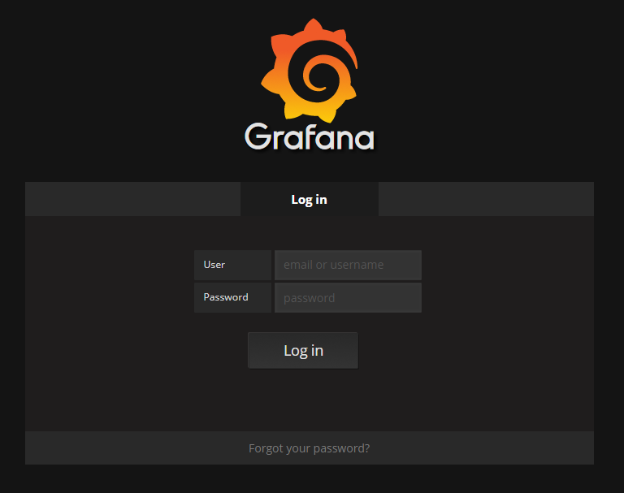
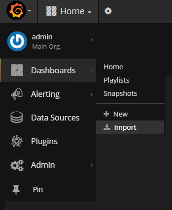
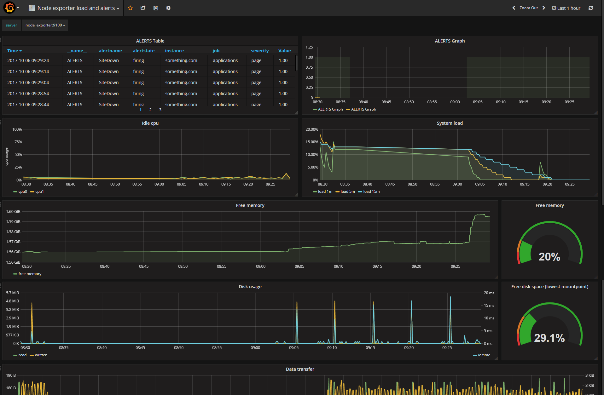
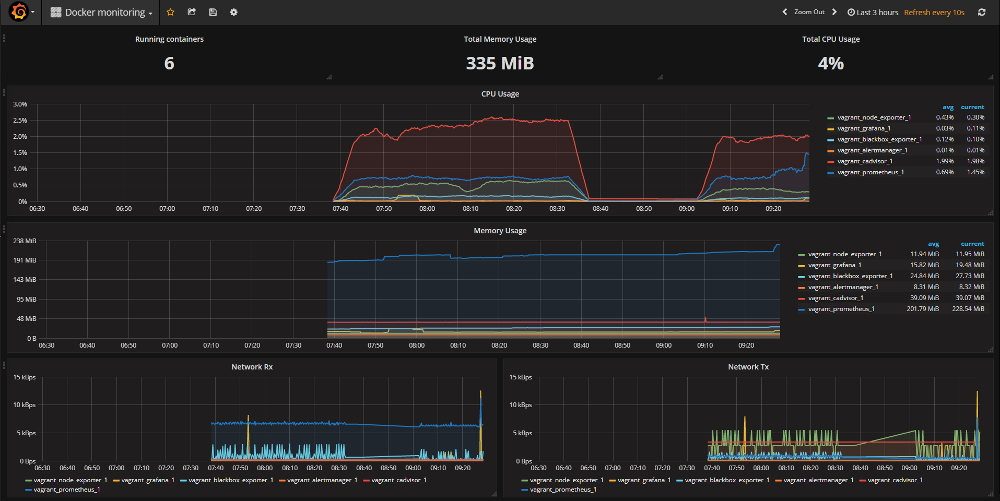

# Vagrant deployable Prometheus monitoring stack
----------


An easy to deploy prometheus stack inside a virtual environment without polluting your system. Provision or initilize the enviroment with few steps.

The stack consists of:
* [Prometheus](https://prometheus.io/)
* [Grafana](https://grafana.com/)
* [cAdvisor](https://github.com/google/cadvisor)
* [Blackbox-exporter](https://github.com/prometheus/blackbox_exporter)
* [Node-exporter](https://github.com/prometheus/node_exporter)
* [Alert-Manager](https://github.com/prometheus/alertmanager)

----------


#### Requirements

* [VirtualBox](https://www.virtualbox.org/wiki/Downloads) >= 5.1.22 
* [Vagrant](https://www.vagrantup.com/downloads.html) >= 1.9.6

This should work on most of Linux, Windows and OSx distributions that support the listed versions of the software.

## Set-Up
----------


Clone the repository

```bash
git clone https://github.com/ivanovaleksandar/prometheus-docker-stack.git
cd prometheus-docker-stack/
```

----------


##### *NOTE: Skip this step to keep the default settings*

Tweak the provisioning values inside the *Vagrantfile* to your liking: 
> change the provider `config.vm.provider 'virtualbox'` with any another tool for virtualization (vmware...)
> change the IP address `ip: '<ip-addr>'` or the memory `vb.memory = 2048` for the virtual machine

## Auto-Provision
----------


Initialize the environment by just running:
```bash
vagrant up
```

Please be patient for the auto-provisioning to be finished:
* the vagrant image is downloaded
* virtual machine is created
* salt is downloaded and installed
* salt is downloading and installing tools like docker and docker-compose

After this process is finished, ssh into the newly created VM:
```bash
vagrant ssh

cd /vagrant
docker-compose up -d
```

Docker-compose will download all the latest images used in this stack and then start up all the needed services (containers).

### GRAFANA
----------


Grafana is a tool that used for visulaization of variety of paramethers, metrics and stats. To feed Grafana with data, we need to connect Prometheus as the data source inside the UI.

Go to your browser to `http://<vagrant-ip>:3000`, the same IP that was set-up previously for the virtual machine *(default: 192.168.10.50)*
Login with user/password credentials ***admin/admin***. 


Then, connect Prometheus as the **Data Source** for Grafana.

 

After successful connection with Prometheus, import the already prepared Grafana [dashboards](config/grafana)




**Node Exporter** metrics:
* Alerts table and graph 
* Node idle time on every CPU
* Node System Load stats on 1m, 5m and 15m time frames
* Node Free Memory graph and meter
* Node Disk Usage graph and meter
* Node network transmitet and received Data


**cAdvisor Docker Host Exporter** metrics:
* Number of running containers on the Host 
* Docker Host memory and CPU usage graphs and number stats
* Docker Host network transmitet and received Data

### Tasks
----------
Already finished tasks:
- [x] Vagrantfile for automatic provisioning
- [x] Salt auto-configuration formulas 
- [x] Docker-Compose file for monioring tools (Prometheus, Grafana, Alert-Manager, cAdvisor, Blackbox-exporter, Node-Exporter)
- [x] Docker-Compose file

Future tasks:
- [] Salt formula for auto-starting and maintaining Docker containers as service
- [] More Grafana dashboards
- [] More Alert definitions